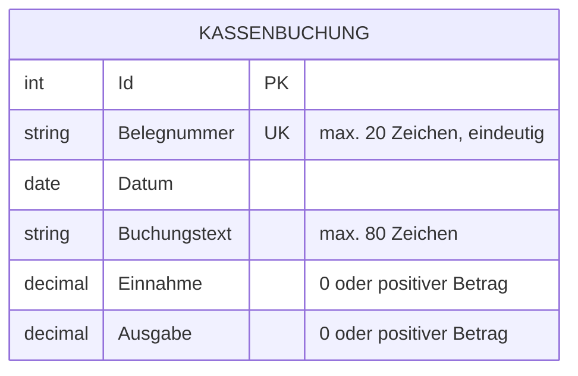
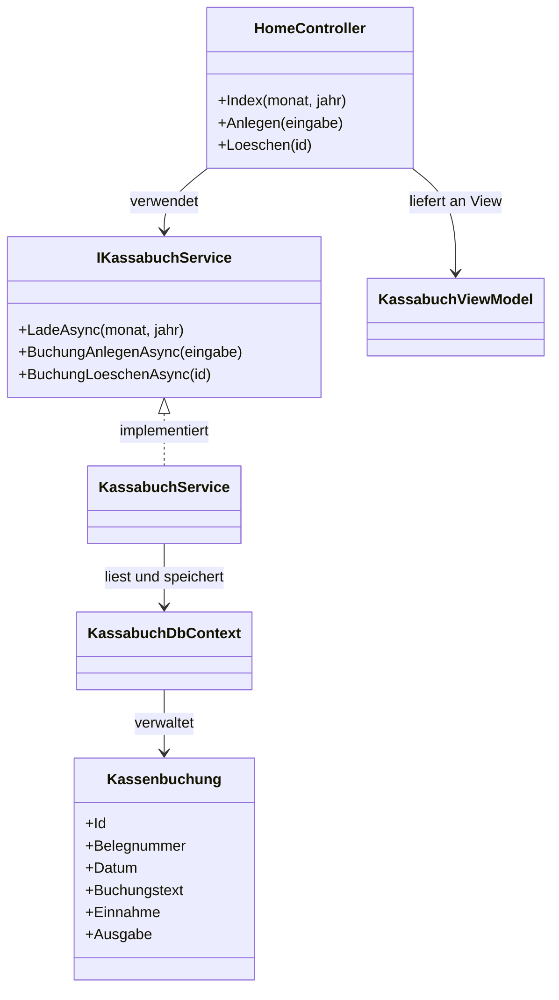

# Planungsdokumentation – Kassabuch

## 1. Ziel der Anwendung

Das Kassabuch erfasst Bargeldbewegungen anhand eindeutiger Belege. Zu jedem Beleg wird entweder eine Einnahme oder eine Ausgabe gespeichert; daraus berechnet die Anwendung automatisch den laufenden Kassenstand.

## 2. Skizze des Datenmodells

### ER-/Datenbankdiagramm



Die SQLite-Datenbank enthält die Tabelle `Kassenbuchungen`. Genau eines der beiden Betragsfelder muss größer als null sein; die Belegnummer besitzt einen eindeutigen Index.

### UML-Skizze der Anwendung



## 3. Skizze der geplanten Ansichten

### Desktop-Ansicht

```text
+------------------------------------------------------------------------------+
| KB Kassabuch                                  Belege · Einnahmen · Ausgaben  |
+------------------------------------------------------------------------------+
| DIGITALES KASSENBLATT                         +----------------------------+ |
| Jeder Beleg. Jeder Betrag. Klar.              | Aktueller Kassenstand      | |
|                                               |                  440,70 €  | |
+------------------------------------------------------------------------------+
| Einnahmen im Filter | Ausgaben im Filter | Angezeigte Belege               |
+------------------------------------------------------+-----------------------+
| Zeitraum: Monat | Jahr | Anzeigen | Zurücksetzen    | Neuer Beleg           |
+------------------------------------------------------+ Belegnummer           |
| Datum | Beleg | Buchungstext | Ein | Aus | Saldo    | Datum                 |
| ...                                                  | Buchungstext          |
|                                                      | Einnahme | Ausgabe    |
|                                                      | [Beleg verbuchen]     |
+------------------------------------------------------+-----------------------+
```

### Mobile Ansicht

```text
+-----------------------------+
| KB Kassabuch                 |
+-----------------------------+
| Überschrift                  |
| Aktueller Kassenstand        |
+-----------------------------+
| Summen untereinander         |
+-----------------------------+
| Zeitraumfilter               |
+-----------------------------+
| Seitlich scrollbar: Tabelle  |
+-----------------------------+
| Formular für neuen Beleg     |
+-----------------------------+
```

Die Desktop-Ansicht zeigt Kassenblatt und Eingabeformular nebeneinander. Auf kleinen Bildschirmen werden die Bereiche untereinander angeordnet, während die breite Kassentabelle scrollbar bleibt.

## 4. Wichtigste Anwendungsbestandteile

**HomeController:** Nimmt Filter- und Formulareingaben entgegen und gibt das fertige ViewModel an die Ansicht weiter. Er prüft zusätzlich, ob eine Belegnummer bereits existiert.

**KassabuchService:** Liest und speichert Kassenbuchungen und berechnet den Saldo chronologisch aus Einnahmen minus Ausgaben. Auch beim Filtern berücksichtigt er frühere Belege für einen korrekten laufenden Saldo.

**KassabuchDbContext:** Stellt die Verbindung zur SQLite-Datenbank her und definiert Betragsgenauigkeit sowie den eindeutigen Index der Belegnummer. Die Datenbankdatei wird beim ersten Start automatisch erzeugt.

**KassenbuchungEingabe:** Enthält die Validierungsregeln des Eingabeformulars. Es stellt sicher, dass genau eine Einnahme oder Ausgabe größer als null eingetragen wurde.

**KassabuchViewModel:** Bündelt Buchungszeilen, Summen, Kassenstand, Filterwerte und die neue Eingabe für die Ansicht. Dadurch bleibt die Razor View übersichtlich.

**Razor View:** Zeigt Kopfbereich, Summen, Filter, Kassentabelle und Eingabeformular. Ein kleines JavaScript leert automatisch die jeweils andere Betragsseite.

## 5. Validierungs- und Geschäftsregeln

1. Jede Belegnummer ist eindeutig und höchstens 20 Zeichen lang.
2. Ein Buchungstext ist erforderlich und höchstens 80 Zeichen lang.
3. Pro Buchung ist genau eine Einnahme oder eine Ausgabe größer als null erlaubt.
4. Der laufende Saldo wird nach Datum und danach nach interner ID berechnet.
5. Nach dem Löschen eines Belegs wird der Saldo aus allen verbleibenden Belegen neu berechnet.
